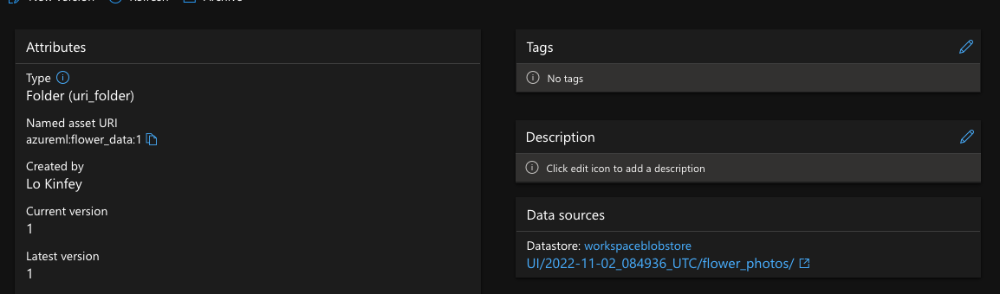
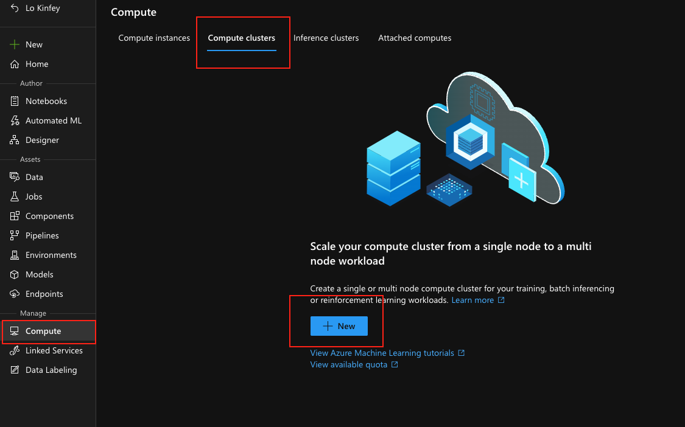
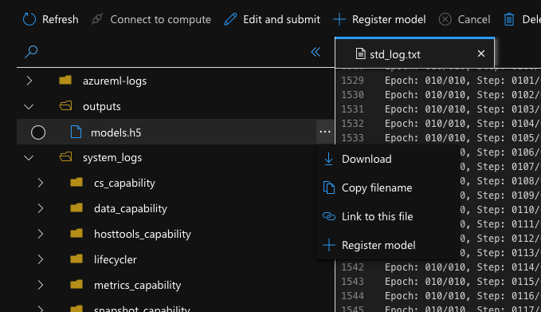

# .NET Machine Learning with Azure ML

This is an example for .NET Machine Learning with Azure ML

## **A. Preparation**

Build an Azure Machine Learning service environment from the Azure Portal, because you need to use GPU, so remember to select "West US2" for the region


After the creation is successful, you can enter the relevant resource group and record the Resource Group and Azure ML Service Name just created


You can enter Azure Machine Learning Studio by clicking on the Studio Web URL


 
## **B. Data prepare**

The data is the most important part in Azure ML. With Azure ML, you can manage data, including data storage, version management, and data feature extraction. We can manage different data from the data options in the Azure ML portal.

1. Select Assets in the left menu bar, select Data, select Data assets to add


2. Create data, give the name and the corresponding format, you can download the data here through this link https://github.com/kinfey/HandsOnLab/tree/main/MLNetLab/tfnetcode/TF_DEEP_WIN_GPU_LearnDemo/image/flower_photos


3. Upload data from local


After the upload is successful, you can see the relevant information



Record the name of the Named asset URI, here is azureml:flower_data:1

## **C. Training**

Everyone will see data training as a very important part. In .NET you can choose ML.NET or TensorFlow.NET / TorchSharp for training, from many docs or you only see the Python way with Azure ML . I will share the way of using .NET here.

First you need to build your compute on Azure ML, click the menu "Compute", and then select "Compute clusters". By creating, select GPU and choose to use K80 (if you need other computing power, you need apply for it )




After the construction is completed, you need to adjust the code here. Use the image classification example of Tensorflow.NET here and make some adjustments. You can refer to my GitHub to get the code https://github.com/kinfey/dotNETMLinAzureML 

There are a few points to note here, because on Azure ML, all computing power is based on Linux and GPU, so please use the GPU version of Tensorflow.NET Linux when loading the Tensorflow.NET library. You can refer to

````xml

<PackageReference Include="SciSharp.TensorFlow.Redist-Linux-GPU" Version="2.5.0" />
<PackageReference Include="TensorFlow.Keras" Version="0.7.0" />
<PackageReference Include="TensorFlow.NET" Version="0.70.1" />

````

We need to make .NET run on Azure ML, we need to have a container environment to run together. This is like, you need a .NET runtime environment and add computing power.

In Azure ML, you can configure yaml locally to set relevant content, including the statement to be executed, the path related to data storage, the operating environment, and the required computing power. As follows


```json

$schema: https://azuremlschemas.azureedge.net/latest/commandJob.schema.json
command: |
  FILENAME=libtensorflow-gpu-linux-x86_64-2.5.0.tar.gz
  wget -q --no-check-certificate https://storage.googleapis.com/tensorflow/libtensorflow/${FILENAME}
  tar -C /usr/local -xzf ${FILENAME}
  ldconfig /usr/local/lib
  cd code
  dotnet restore
  dotnet build
  dotnet run --dataPath ${{inputs.data_dir}} --outputPath outputs 
code: .
inputs:
  data_dir:
    type: uri_folder
    path: azureml:flower_data:1
experiment_name: tf-image-training
environment: 
  build:
    path: .
    dockerfile_path: Dockerfile
compute: azureml:GPUCluster

```

### **Additional Notes**

1. input: corresponds to the input data, which can correspond to the data set in Azure ML, you can select the folder and file type

2. command: Corresponds to the file you want to execute, because Tensorflow.NET requires libtensorflow, you must do the relevant download and set it up in the runtime environment

3. environment: Environment dependency, you can set the container directly, but I prefer to set the environment on the Dockerfile, so that you can add the support you need at any time, such as ML.NET CLI environment or some packages, etc., the following is my Dockerfile

````json

FROM mcr.microsoft.com/dotnet/sdk:6.0
RUN apt install wget

````

4. compute: is the corresponding created computing power

After the local yaml environment, you can run the corresponding script locally (you must install the Azure CLI environment, and the extension support of the Azure ML SDK v2, which is required. You can click this address to learn more), in this Perform the following steps in the machine environment

5. experiment_name: You can give the training a name, which I think is quite useful, and can be classified according to different projects

```cmd

az configure --defaults group=CUDAWSGroup workspace=CUDAWS

````

```cmd

az ml job create --file AzureTrain.yml

````

If the execution goes well, you can start your .NET machine learning/deep learning training directly through Azure ML. The following figure is the content of each training seen by clicking job


You can also click on a training to learn more


*This example is not a perfect algorithm, but it is enough to illustrate the problem. Of course, you can adjust the algorithm to improve the accuracy through the program settings*


## **D. Testing**

You can add test samples to the program to see the results, which will be discussed with you in the future

## **E. Deployment**

If you are satisfied with a certain model training, you can choose to register the model generated by the training and deploy it to the endpoint. You can choose to use yaml to complete it locally, but some small partners like to use some manual operations on the Azure portal can also

1. Model registration

Select Models, and click Register, select From a job input


Choose the training you need


You can then select the corresponding model from the outputs folder as a deployment


After the deployment is successful, you can see the relevant model information


Of course, you can also not deploy on Azure, you can download the model in Jobs for use on different platforms




2. Generate the service in Endpoints

Or you need to deploy the service directly on Azure. At this time, you only need to click Endpoints to associate with the corresponding service. Or I prefer to use Azure Functions to complete this step, I will tell you about this later

Managed deployment and Kubernetes deployment can be supported on Azure, it depends on what method you need


### **Links**

1. Free Azure account  https://azure.com/free
2. Azure for student https://aka.ms/studentgetazure
3. Learn about Azure ML https://learn.microsoft.com/en-us/azure/machine-learning/overview-what-is-azure-machine-learning
4. Install the Azure CLI https://learn.microsoft.com/en-us/cli/azure/install-azure-cli
5. Install Azure ML SDK v2 https://learn.microsoft.com/en-us/azure/machine-learning/how-to-configure-cli?tabs=public
6. Learn about ML.NET https://dotnet.microsoft.com/en-us/apps/machinelearning-ai/ml-dotnet
7. Learn about Tensorflow.NET https://github.com/SciSharp/TensorFlow.NET
8. Learn Tensorflow.NET related cases https://github.com/SciSharp/SciSharp-Stack-Examples